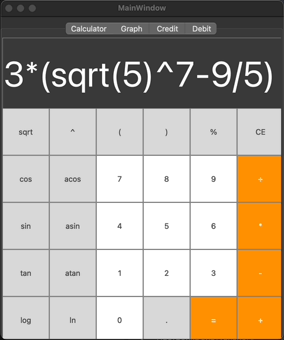

# SmartCalc v1.0 Implementation Summary

## Overview

SmartCalc v1.0 takes the ordinary calculator to new heights. Developed in the C programming language following structured programming principles, this advanced calculator performs standard arithmetic functions and introduces enhanced capabilities like calculating complex arithmetic expressions and graphing functionalities. Moreover, financial tools for credit and deposit evaluations are considered as potential augmentations.



## Installation
````
git clone https://github.com/0xmisha/smartcalc_v1.0.git
cd smartcalc_v1.0/src
make
````

## Requirements

- Gcc
- Make
- QT >= 5.0 (incl. qmake)
- check.h (for tests)

## Core Features

1. **Arithmetic Calculations**: Beyond rudimentary arithmetic operations, SmartCalc v1.0 calculates sophisticated arithmetic expressions, honoring the order of operations. It recognizes both integers and real numbers, with optional support for exponential notation. After entering an expression and pressing the `=` symbol, the calculator performs the computation, ensuring fractional part accuracy up to seven decimal places.

2. **Function Graphing**: The calculator visualizes functions given in infix notation using the variable _x_. Graphs showcase coordinate axes, a marked scale, and an adaptive grid. Although users can't modify the scale, they must specify the displayed domain and codomain. The domain and codomain range from -1000000 to 1000000.

3. **Variable Support**: It integrates the variable _x_, allowing dynamic calculations and graphing based on its value.

4. **Enhanced Mathematical Functions**: Apart from classic arithmetic operations like addition, subtraction, and multiplication, SmartCalc recognizes advanced functions including sine, cosine, logarithms, and square roots. Each function and operation is supported in infix, prefix, and postfix notation.

5. **Financial Calculators**: 
   - **Credit Calculator**: This bonus mode helps users determine monthly payments, total payments, and overpayments on credits, factoring in details like credit amount, term, interest rate, and payment type (annuity or differentiated).
   
   - **Deposit Calculator**: Another bonus mode, it assesses deposit profitability, accounting for aspects like deposit amount, term, interest rate, tax rate, periodicity, capitalization, replenishments, and withdrawals. It provides accrued interest, tax amount, and deposit total at term's end.

## Technical Details

- **Programming & Tools**: SmartCalc adheres to the C11 standard and utilizes the gcc compiler. It permits the integration of QT libraries and modules.
 
- **Directory & Build Structure**: The source code is housed in the `src` folder. A comprehensive Makefile facilitates building processes with a standard set of GNU-targets, including `all`, `install`, `uninstall`, `test`, and `gcov_report`.

- **Coding Standards**: Throughout development, the Google coding style was meticulously followed.

- **Testing**: Unit tests, developed using the Check library, provide robust coverage for modules associated with expression calculations.

- **User Interface**: The UI is crafted using a GUI library that supports C standards. This ensures cross-platform consistency, be it Linux, Mac, or others.

- **Input Constraints**: Users can key in up to 255 characters, facilitating extensive calculations.

SmartCalc v1.0, with its fusion of standard arithmetic functionalities and advanced mathematical and financial tools, is a comprehensive solution for diverse computational needs, all bundled within an intuitive, user-friendly interface.